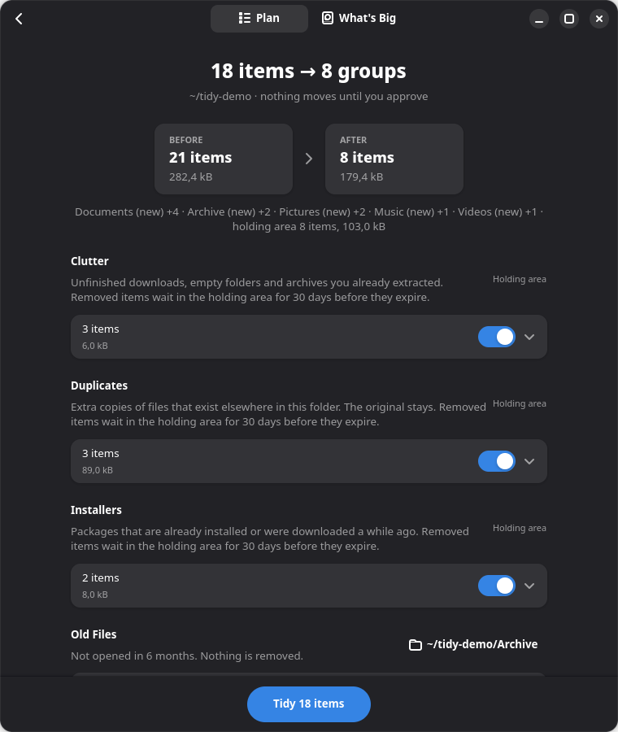
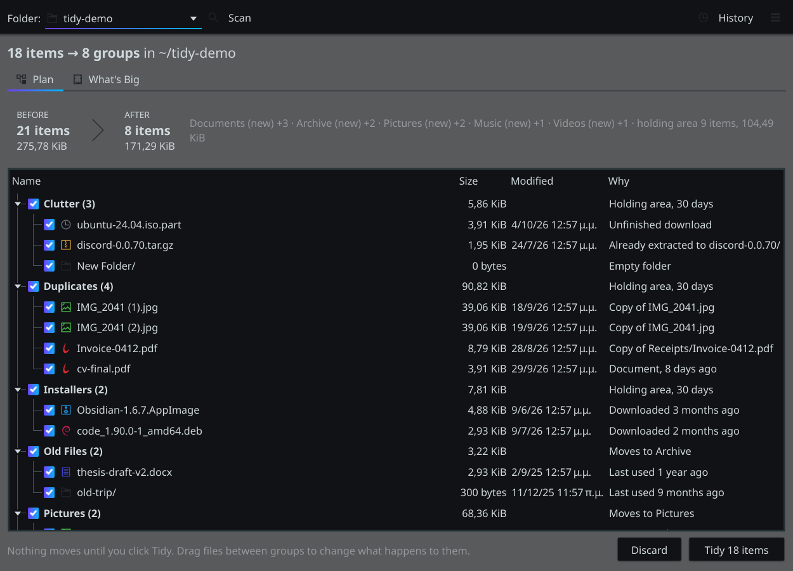
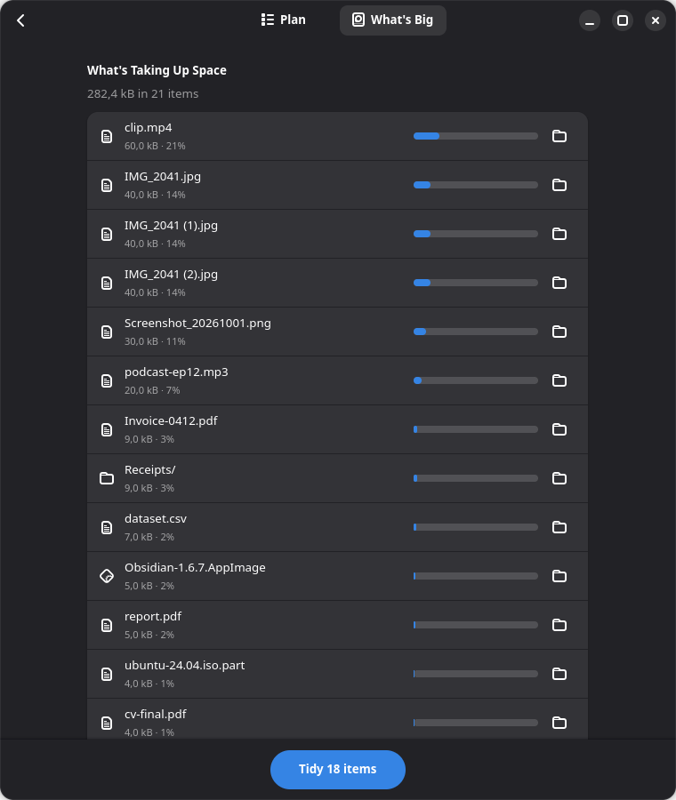
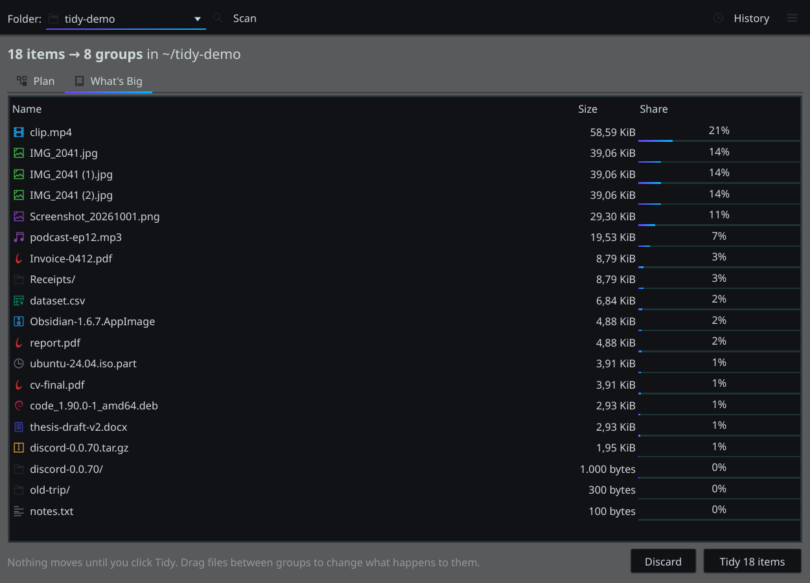
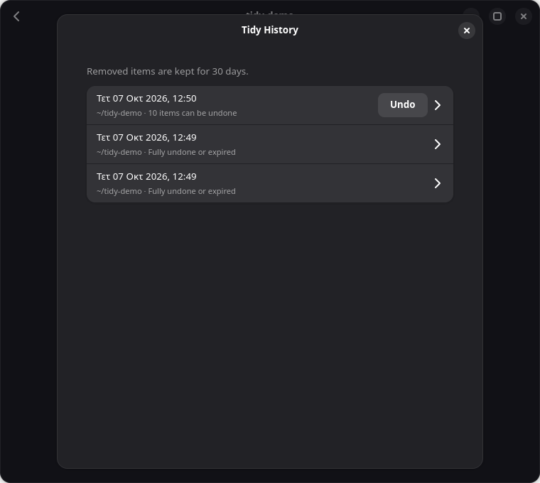

# Tidy

A folder cleanup tool for Downloads, Desktop or any messy folder.

Point it at a folder and it shows you a plan to tidy it. You approve the plan,
it runs, and you can undo it. You never need to write a rule or know what a
glob is.

<p align="center">
  
  
</p>

Tidy has two native frontends that share one core:

- **GTK4 + libadwaita** for GNOME, and for most other desktops
- **Qt 6** for KDE Plasma and LXQt

`tidy` picks one from `XDG_CURRENT_DESKTOP`. To force one, use `tidy --gtk`,
`tidy --qt` or `TIDY_UI=qt tidy`. If the preferred toolkit is missing, it
falls back to the other one.

## How it works

1. **Pick a folder.** Downloads, Desktop and Documents are one click away, or
   choose any other folder.
2. **Scan.** Tidy looks at every file's type, age, size and name. Scanning
   never changes anything.
3. **Review the plan.** You see a before/after summary ("21 items → 8 items")
   and a group for each kind of mess.
4. **Tweak.** Untick groups or single files, drag a file into another group, or
   change where a group goes.
5. **Tidy, then undo if you want.** Tidy History reverses a whole run or single
   files.

## What it finds

| Group | What | What happens |
|---|---|---|
| Clutter | `.part`/`.crdownload` files older than a day, empty folders, archives sitting next to the folder they were extracted to | holding area |
| Duplicates | byte-identical copies. Only top-level copies are removed, and a copy already filed in a subfolder is the one kept | holding area |
| Installers | `.deb`, `.rpm` and `.pkg.tar.zst` packages that are already installed, or any installer older than 30 days | holding area |
| Old Files | top-level files and folders not used in 6 months | moved to `Archive/` |
| Screenshots, Receipts, Tax (per year) | screenshots by name; receipts, invoices and tax documents by name, or for PDFs by their text ("Invoice number", "Amount due", "Tax return"). The year comes from the name, else the file's date | moved to a folder such as `Receipts 2026` |
| Pictures, Documents, Music, Videos, Archives | the remaining loose files, by extension, or by their first bytes when there is no extension | moved to a folder per type |

**Tidy learns from you.** When you tidy, it remembers two things:

- **Changed destinations.** If you send Pictures to `~/Pictures`, the next scan
  suggests that again. For per-year groups, the year stays a placeholder, so
  `Shots/2025` becomes `Shots/2026` next year.
- **Files you dragged into another group.** It remembers the name pattern with
  the numbers blanked out, so after you file `IMG_2041.jpg` under Receipts,
  `IMG_2077.jpg` goes there too.

Run `tidy-cli forget` to clear what it learned.

## Your rules

Write rules as plain sentences in `~/.config/tidy/rules.txt`, one per line,
or add them with `tidy-cli rules --add "..."`:

```
Move PDFs older than 30 days from Downloads to Documents/Old PDFs
Put screenshots in Pictures/Screenshots automatically
Hold installers older than 2 weeks
Move files named "*.torrent" to Torrents
Watch Downloads and Desktop, and tell me after 30 new files
```

- **The pattern:** a verb, then which files, then optional parts.
  - **Verbs:** *Move*, *Put*, *File*, *Send* or *Sort*. Or *Hold*, *Remove*,
    *Delete* or *Get rid of*, which all go to the holding area. Nothing is
    ever deleted outright.
  - **Which files:** pictures, documents, music, videos, archives,
    screenshots, receipts, tax documents, installers, extensions such as
    `PDFs` or `jpg files`, or `files named "*.iso"`.
  - **Optional parts:** `from <folder>`, `older than <n> days/weeks/months/years`,
    `to <folder>`, and `automatically`.
- **Destinations:** a folder that exists in your home folder (such as
  `Documents/Old PDFs`) goes there. Any other name is created inside the folder
  being tidied.
- **Checking them:** `tidy-cli rules` shows how Tidy reads each line and
  explains any it can't read.
- **Priority:** your rules come before Tidy's own groups and show up in the
  plan like any other group.

### Watch mode

Turn it on from **Watch Folders…** in the app's main menu, or with
`tidy-cli watch --on`. Either way, a small background watcher starts and is
added to your session's autostart. In the app you can also add or remove
watched folders, set how many new files trigger a notification, and set how
often it checks. The app saves these as the `Watch` line in your rules file,
and the watcher picks up changes within half a minute. Every 15 minutes it looks at the folders in your `Watch`
lines (Downloads if there are none):

- **Notifications.** When enough new files have arrived (20 by default), it
  sends one notification: "47 new files in Downloads. Tidy up?". Clicking
  **Tidy Up** opens the plan. It doesn't ask again until more new files
  arrive.
- **Auto-tidy is opt-in per rule.** Only rules that end in *automatically*
  (or start with *Always*) move files without asking. Each automatic run is in
  Tidy History, and its notification has an **Undo** button.

To stop it, run `tidy-cli watch --off`. To see whether it's running, run
`tidy-cli watch --status`.

The **What's Big** tab shows which items take up the most space.

<p align="center">
  
  
</p>

## Safety

Trust is the whole point, so these rules hold everywhere:

- **Preview first.** Nothing moves until you click Tidy.
- **Nothing is deleted outright.** Removed items go to a holding area and
  expire after 30 days. The holding area is `~/.local/share/tidy/holding`, or
  `.tidy-holding-<uid>` on the same drive as the files.
- **Every move is logged before it happens** in SQLite
  (`~/.local/share/tidy/tidy.db`), so a run that is interrupted is reconciled
  on the next start.
- **Undo puts files back exactly where they were.** If the original name has
  been taken since, the file comes back as `name (2)`.
- **No overwrites.** Moves use `renameat2(RENAME_NOREPLACE)`.
- **Files that changed since the scan are skipped.** So are files modified in
  the last 10 minutes, which may still be downloading.
- **Protected locations:**
  - system folders and the home folder itself
  - hidden files and folders
  - git, hg and svn repositories
  - project folders (`package.json`, `Cargo.toml`, `pyproject.toml`, …)
  - other drives and symlinks
  - folders Tidy made itself, which carry a `.tidy-folder` marker
- **Old files stay old.** Scanning reads files with `O_NOATIME`, so a scan
  never makes an old file look recently used.
- **Local only.** There's no network, no account and no telemetry.

<p align="center">
  
</p>

## Install

Tidy runs on the system Python 3.10+ with the distribution's own GTK and Qt
bindings. The core uses only the standard library. Install the bindings for
your desktop. You can install both.

| Distribution | GTK frontend | Qt frontend |
|---|---|---|
| Arch, Manjaro, EndeavourOS | `sudo pacman -S python-gobject libadwaita` | `sudo pacman -S pyside6` |
| Ubuntu 24.04+, Debian 13+, Mint 22+ | `sudo apt install python3-gi gir1.2-adw-1` | `sudo apt install python3-pyside6.qtwidgets python3-pyside6.qtdbus` (Ubuntu 26.04+, Debian 13+) |
| Fedora | `sudo dnf install python3-gobject libadwaita` | `sudo dnf install python3-pyside6` |
| openSUSE Tumbleweed | `sudo zypper install python3-gobject typelib-1_0-Adw-1` | `sudo zypper install python3-pyside6` |

The GTK frontend needs libadwaita 1.5 or newer.

Then:

```sh
./install.sh      # links tidy and tidy-cli into ~/.local/bin and adds a menu entry
./uninstall.sh    # removes them; your history and holding area stay
```

`install.sh` checks which frontends actually load and tells you if one is
missing.

## Use

```sh
tidy                              # open the app
tidy ~/Downloads                  # open it and scan straight away
tidy-cli scan ~/Downloads         # dry run in the terminal
tidy-cli scan ~/Downloads --apply # carry the plan out
tidy-cli history                  # past runs and every move
tidy-cli undo 3                   # undo run 3
tidy-cli undo --move 41           # put back a single file
tidy-cli purge                    # expire held items older than 30 days now
tidy-cli forget                   # clear learned destinations and name patterns
tidy-cli rules                    # show your rules and how Tidy reads them
tidy-cli rules --add "Hold installers older than 2 weeks"
tidy-cli watch --on               # watch folders and notify (also --off, --status)
```

## Tested distributions

Every release runs the full test suite inside clean containers of each
distribution, using that distribution's packaged GTK, libadwaita and PySide6:

| Distribution | Python | GTK frontend | Qt frontend | install.sh + CLI |
|---|---|---|---|---|
| Ubuntu 26.04 LTS | 3.14 | ✅ | ✅ | ✅ |
| Ubuntu 24.04 LTS | 3.12 | ✅ (libadwaita 1.5) | — no PySide6 package | ✅ |
| Debian 13 (trixie) | 3.13 | ✅ | ✅ | ✅ |
| Fedora 44 | 3.14 | ✅ | ✅ | ✅ |
| Arch Linux | 3.14 | ✅ | ✅ | ✅ |
| openSUSE Tumbleweed | 3.13 | ✅ | ✅ | ✅ |

Last run: 2026-10-08. Mint, Pop!_OS and Zorin use Ubuntu's packages,
and Manjaro and EndeavourOS use Arch's. Ubuntu 24.04 (and Kubuntu 24.04) has no
PySide6 package, so it uses the GTK frontend everywhere.

## Tests

```sh
/usr/bin/python3 -m unittest discover -s tests   # core + both GUIs
tests/distro/run.sh                              # all distributions (needs Docker)
tests/distro/run.sh fedora:latest                # just one
```

- **`tests/test_core.py`** covers the rules, the safety checks, no-clobber
  moves, apply and undo round trips, expiry and crash recovery.
- **`tests/test_watch.py`** covers the sentence parser, rules in plans, and
  the watcher: when it notifies, auto-tidy, and Undo.
- **`tests/test_cli.py`** runs every `tidy-cli` command in a throwaway home
  folder. It also covers localised folder names, the destination safety
  check, the single-watcher lock and autostart, and runs `install.sh` and
  `uninstall.sh` for real.
- **`tests/test_gui.py`** drives each frontend for real: it scans a messy
  folder, moves a file between groups, tidies, opens History and undoes, then
  checks the folder is byte-for-byte what it was. A frontend whose toolkit
  isn't installed is skipped.
- **`tests/distro/run.sh`** does the following inside each container:
  1. installs the distribution's packages
  2. runs both test files under Xvfb
  3. runs `install.sh`
  4. runs a CLI apply and undo
  5. checks which frontend the launcher picks on GNOME

  Logs go to `$TMPDIR/tidy-distro-logs`.

## Layout

```
tidy/core/     scanning, rules, plan, moves, history (stdlib only)
tidy/gtk/      GTK4 + libadwaita frontend
tidy/qt/       Qt 6 (PySide6) frontend
tidy/cli.py    tidy-cli
tidy/watch.py  watch mode and notifications
tidy/__main__  picks a frontend
tests/         unit, GUI and distribution tests
```

## Roadmap

- **v0.3:** ✅ content-aware groups (screenshots, receipts, tax documents)
  with suggested names such as "Receipts 2026", and learning from where you
  move things.
- **v0.4:** ✅ watch mode with gentle notifications ("47 new files. Tidy
  up?"), and rules written as plain sentences. Nothing moves without asking
  unless you turn on auto-tidy for a rule.
- **Next:** editing your rules from the app itself (watch settings are
  already there).

See [CHANGELOG.txt](CHANGELOG.txt) for what changed in each version.
